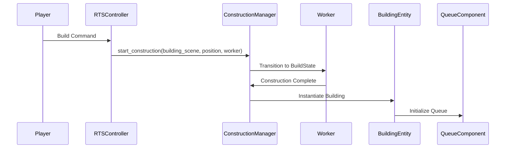
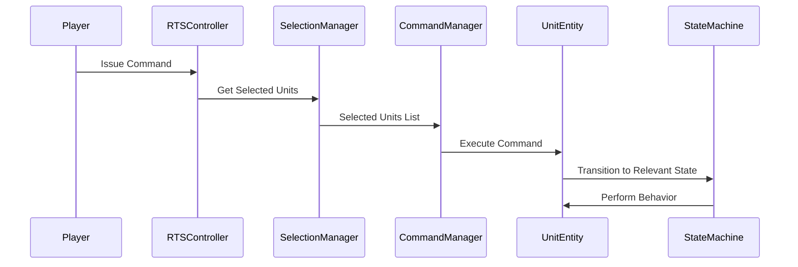

# RTS Game Framework

> [!CAUTION]  
> This project is a **Work in Progress (WIP)** and is not intended for production use.  
> Features may be incomplete, and unexpected bugs or performance issues are likely to occur.  
> Before diving in, we strongly recommend checking the **Issues** tab to understand the current state of development and known limitations.  
> Use this framework for experimentation, learning, and fun, but please don’t expect a fully polished or optimized experience.

## Introduction

**RTS Game Framework** is a modular and extensible architecture designed for creating Real-Time Strategy (RTS) games in Godot 4. This framework is built with flexibility in mind, leveraging reusable components, a robust state system, and clean separation of responsibilities to facilitate efficient game development.

## Overview

This framework is organized into several key systems and modules, each designed to handle a specific aspect of RTS game functionality. The main systems include:

### Core Systems

Core systems provide the foundational logic and structure for the game. These systems interact with each other to coordinate high-level gameplay.

[Read more](./docs/core/README.md)

### Entities

Entities are the primary building blocks of the game world. They represent units, buildings, resources, and other in-game objects. Each entity can be enhanced by attaching modular components.

[Read more](./docs/entities/README.md)

### Components

Components are modular pieces of functionality that can be attached to entities. They allow for extending entity behavior without creating tightly coupled, monolithic systems.

[Read more](./docs/components/README.md)

### State System

The State System provides a flexible and reusable way to manage entity behavior. It uses a `StateMachine` to coordinate transitions between individual `State` instances.

[Read more](./docs/states/README.md)

### Managers

Managers are specialized systems that handle specific gameplay mechanics. They are responsible for coordinating interactions, such as unit selection and command issuance.

[Read more](./docs/managers/README.md)

## Key Features

1. **Modular Architecture**: Systems and components are designed to be independent and reusable.
2. **Entity-Component Design**: Entities are extended through attachable components, avoiding monolithic logic.
3. **Flexible State System**: Behavior-driven states allow dynamic entity functionality.
4. **Event-Driven Communication**: Systems interact using signals, reducing tight coupling and enhancing scalability.
5. **Customizable Gameplay**: The framework supports Command & Conquer or Age of Empires-style gameplay, with options for queue-driven or worker-driven construction.

## The Principles of the Framework

The RTS Framework is built on two foundational principles: **decoupling** and **signal-driven architecture**. These principles ensure the framework remains modular, maintainable, and extensible, allowing developers to build complex systems with minimal friction.

By combining decoupling with signal-driven architecture, the RTS Framework achieves:

- **Independent Systems**: Each manager or component handles its logic without assuming the internals of others.
- **Event-Driven Logic**: Signals ensure clean and non-intrusive communication between systems.
- **Customizability**: Developers can add, replace, or extend features without disrupting the framework.

### Decoupling

Decoupling refers to the practice of designing systems so that components and modules are independent and only interact through well-defined interfaces or abstractions.

**Why Decoupling Matters in RTS Games:**

1. **Modularity:**
    - Each subsystem (e.g., selection, commands, state management) is designed to function independently. This modularity allows for easy replacement, enhancement, or debugging of individual components without affecting the rest of the system.
    - Example: The `SelectionManager` focuses solely on handling unit selection, while the `CommandManager` handles issuing commands. They don’t directly depend on each other.
2. **Reusability:**
    - Decoupled systems are inherently reusable. For instance, components like `SelectableComponent` or `DamageableComponent` can be used across different types of entities (`UnitEntity`, `BuildingEntity`, etc.) without modification.
3. **Scalability:**
    - As RTS games grow in complexity, decoupled systems make it easier to add new features without introducing breaking changes. New components or managers can integrate seamlessly into the existing architecture.
4. **Ease of Maintenance:**
    - Bugs or changes in one subsystem don’t propagate to others. This isolation makes debugging and testing more efficient.

### Signal-Driven Architecture

Signals are event-based mechanisms in Godot that allow nodes to communicate with each other without direct references. A node emits a signal, and any other node can connect to and respond to it.

**Why Signals are Key to RTS Frameworks:**

1. **Loose Coupling:**
    - Signals eliminate the need for nodes to know about each other’s existence. This keeps the system loosely coupled and ensures that changes in one part don’t ripple through the entire framework.
    - Example: The `RTSController` emits `focus_on_position` when units are selected, and the `CameraController` listens for this event to move the camera. Neither needs a direct reference to the other.
2. **Flexibility:**
    - Signals make it easy to plug in or remove functionality dynamically. For instance, a building could emit a `construction_completed` signal, and multiple systems (e.g., resource tracking, UI updates) could listen to it without modifying the building’s logic.
3. **Scalability:**
    - Signals simplify managing many interconnected systems. Instead of hardcoding interactions, you can connect nodes dynamically or configure them in the editor.
4. **Clarity:**
    - By using signals, event-driven flows are explicit and centralized, making the system easier to understand and debug.

**Examples in the RTS Framework:**

- **Unit Selection:**

    The `SelectionManager` emits `units_selected`, which the `RTSController` uses to trigger further actions like issuing commands or focusing the camera.

- **State Transitions:**

    The `StateMachine` emits `state_changed`, allowing other systems (e.g., animation controllers) to react without direct dependency on the state machine.

## System Interaction

The framework leverages clean communication between its systems to streamline gameplay logic. For example:

- The **RTSController** processes player input and delegates selection tasks to the **SelectionManager**.
- Once units are selected, commands issued through the **CommandManager** propagate to the appropriate entities, triggering state changes like moving or attacking.
- The **CameraController** works independently but listens for focus requests from the **RTSController** to align player navigation with game events.

## Sample Workflows

Here some examples how you can use the system together.

### Building Construction

This diagram details how a building construction process flows between the **ConstructionManager**, worker units, and the **QueueComponent** of the building.



### Unit Command

This diagram explains how a command flows from the **RTSController** to the **CommandManager** and then to selected units.



## One step back before you start

To dive into the framework:

1. Review the **Core Systems** section to understand the overarching structure.
2. Explore the **Entities** and **Components** sections to learn how game objects are built and extended.
3. Check the **State System** section to see how behaviors are implemented and managed.
4. Refer to **Managers** for details on handling gameplay-specific tasks like selection and commands.

## Installation

Follow these steps to install and integrate the RTS Framework into your Godot 4 project.

### Download the framework

#### Option 1: Using the Godot Asset Library

1. Open your Godot project.
2. Go to the **Asset Library** tab in the editor.
3. Search for **RTS Framework**.
4. Download and install the asset directly into your project.

#### Option 2: Using GitHub

1. Clone the repository or download the ZIP file:

    ```bash
    git clone https://github.com/rluders/rts-framework.git
    ```

2. Copy the `addons/rts_framework` folder into your Godot project directory.

### Enable the Plugin

- Open your Godot project.
- Go to **Project Settings > Plugins**.
- Locate the **RTS Framework** in the list.
- Enable the plugin by clicking **Activate**.

### Add RTS Framework Nodes to Your Scene

#### Step 1: Add the RTSController

1. Create a new scene or open an existing one.
2. Add the `RTSController` node to the scene (available in the **Create New Node** dialog under `Node -> RTSController`).

#### Step 2: Configure RTSController Subcomponents

1. Add child nodes for `SelectionManager`, `CommandManager`, and any other required managers.
2. Connect the necessary components, such as the `Raycaster` and `CameraController`, to the `RTSController`.

### Setup Environment

#### Step 1: Add a Ground Plane

1. Add a `PlaneMesh` or a terrain scene to act as the ground.
2. Ensure it has the correct collision layers for raycasting.

#### Step 2: Add Lighting and Camera

1. Add a `DirectionalLight3D` for global lighting.
2. Add a `Camera3D` and position it for a top-down RTS view.

### Test the Framework

1. Add example scenes from the `addons/rts_framework/resources` folder:
    - Example units (`Worker.tscn`, `Soldier.tscn`).
    - Example buildings (`Barracks.tscn`, `Factory.tscn`).
2. Play the scene to test unit selection, movement, and basic interactions.

### Customize and Extend

- Modify or extend the framework components to suit your game’s needs.
- Review the provided documentation for detailed explanations of each system and how to integrate additional features.

## Tutorials

- [Selecting Units and Issuing Commands](./docs/tutorials/selecting_units_and_issuing_commands.md)
- [Constructing a Building](./docs/tutorials/constructing_a_building_system.md)

## Contribution

We welcome contributions to the RTS Framework! Whether you’re fixing bugs, adding new features, or improving the documentation, your input is highly appreciated. Follow these steps to contribute:

### How to Contribute

1. **Fork the Repository**:
    - Start by forking the repository to your GitHub account.
2. **Clone Your Fork**:

    ```bash
    git clone https://github.com/rluders/rts-framework.git
    cd rts-framework
    ```

3. **Create a New Branch**:
    - Use a descriptive name for your branch:

        ```bash
        git checkout -b feature/my-new-feature
        ```

4. **Make Changes**:
    - Implement your feature or fix, ensuring the code adheres to the project’s coding standards.
5. **Test Your Changes**:
    - Test thoroughly to ensure compatibility and stability.
6. **Submit a Pull Request (PR)**:
    - Push your changes to your fork:

        ```bash
        git push origin feature/my-new-feature
        ```

    - Open a pull request to the main repository. Provide a clear description of your changes, including the motivation and relevant details.

### **Ways to Contribute**

- **Report Bugs**: Use the GitHub Issues tab to report bugs or unexpected behavior.
- **Suggest Features**: Share ideas for new features or improvements.
- **Fix Issues**: Check the open issues for tasks you can help resolve.
- **Improve Documentation**: Help make the documentation clearer and more comprehensive.

## **Code of Conduct**

Please adhere to our [Code of Conduct](./CODE_OF_CONDUCT.md) to ensure a welcoming and inclusive environment for all contributors.

## **License**

This project is licensed under the MIT License. By contributing to this repository, you agree that your contributions will be licensed under the same MIT License.
