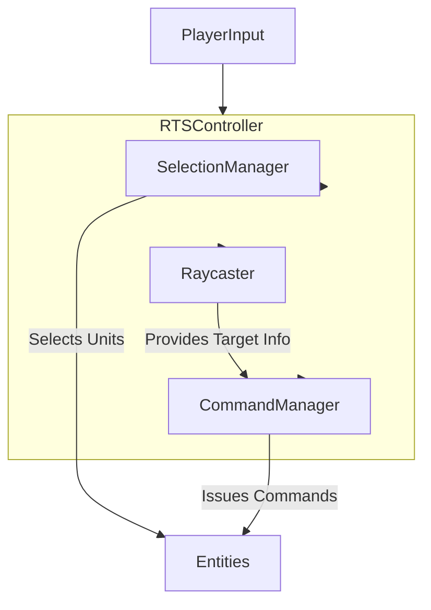

# Core Systems

Core systems provide the foundational logic and structure for the game. These systems interact with each other to coordinate high-level gameplay.

- [RTSController](./rts_controller.md): The central orchestrator for RTS-specific mechanics, such as unit selection and command issuance.
- [Raycaster](./raycaster.md): Handles raycasting for object detection, used for unit selection, targeting, and other interactions.
- [CameraController](./camera_controller.md): Controls camera movement, zoom, and player navigation.

## Diagram

