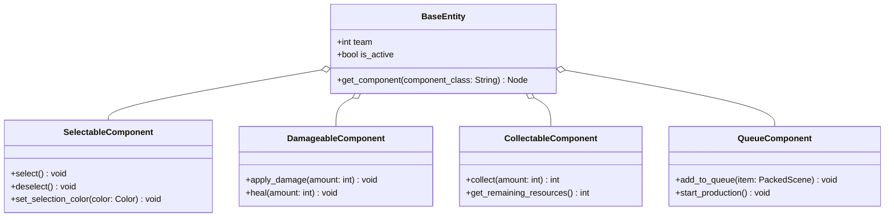

# Entities

Entities are the primary building blocks of the game world. They represent units, buildings, resources, and other in-game objects. Each entity can be enhanced by attaching modular components.

- [BaseEntity](./base_entity.md): A generic class for all game entities.
- [UnitEntity](./unit_entity.md): Represents movable units (e.g., soldiers, tanks).
- [BuildingEntity](./building_entity.md): Represents structures (e.g., barracks, resource depots).
- [ResourceEntity](./resource_entity.md): Represents resource nodes (e.g., gold, wood).

## Diagrams

