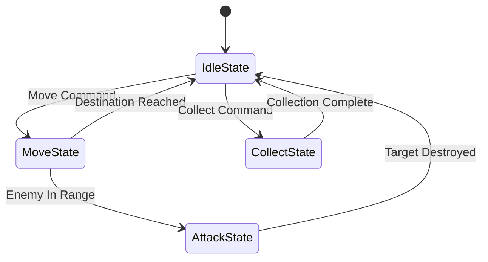

# State System

The State System provides a flexible and reusable way to manage entity behavior. It uses a `StateMachine` to coordinate transitions between individual `State` instances.

- [StateMachine](./state_machine.md): Controls the active state of an entity.
- [State](./state.md): Represents an individual behavior, such as moving, attacking, or collecting resources.

## Diagram

